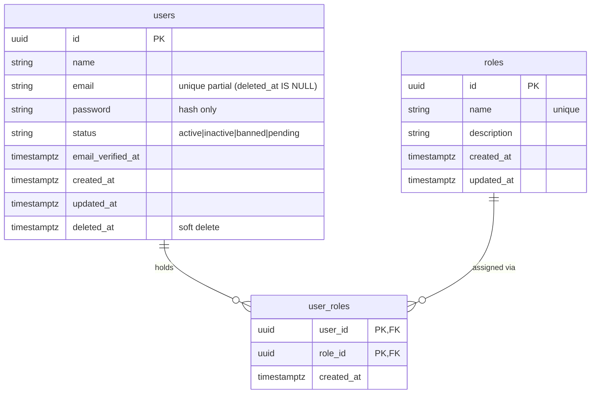
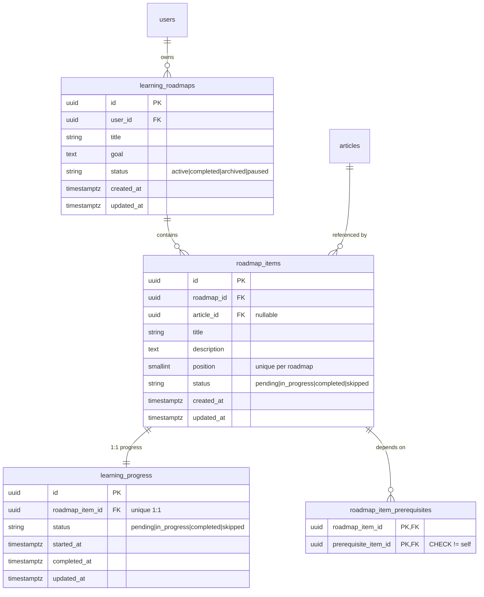
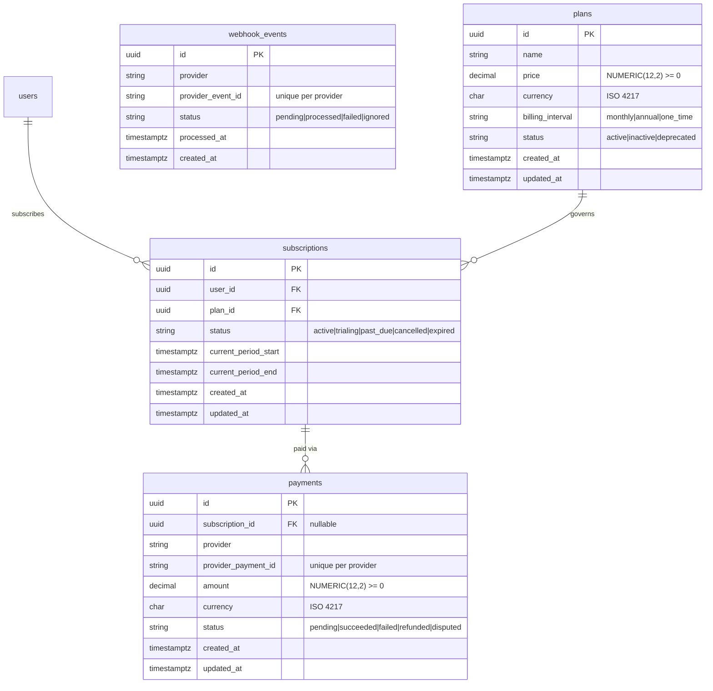

# ERD – KnowledgeHub Database Schema

> Generated: 2026-10-02 | Laravel 11 · PostgreSQL 16 · UUID PKs · timestamptz

Diagrams split by domain. See `docs/DATABASE.md` for full constraint details.

---

## Domain A – Identity and Access Control



---

## Domain B – Knowledge Base

```mermaid
erDiagram
    categories {
        uuid id PK
        string name
        string slug "unique"
        uuid parent_id FK "nullable self-ref"
        timestamptz created_at
        timestamptz updated_at
    }
    articles {
        uuid id PK
        uuid author_id FK
        uuid category_id FK "nullable"
        uuid published_version_id FK "nullable"
        string slug "unique"
        string status "draft|submitted|published|archived|rejected"
        timestamptz published_at
        timestamptz created_at
        timestamptz updated_at
        timestamptz deleted_at "soft delete"
    }
    article_versions {
        uuid id PK
        uuid article_id FK
        int version_no "unique per article"
        string title
        text content
        uuid created_by FK
        timestamptz created_at
    }
    tags { uuid id PK; string name; string slug "unique"; timestamptz created_at }
    article_tags { uuid article_id PK,FK; uuid tag_id PK,FK }
    article_reviews {
        uuid id PK
        uuid article_version_id FK
        uuid reviewer_id FK
        string decision "approved|rejected|changes_requested"
        text comment
        timestamptz created_at
    }
    bookmarks { uuid user_id PK,FK; uuid article_id PK,FK; timestamptz created_at }
    article_attachments {
        uuid id PK
        uuid article_version_id FK
        string object_key "unique S3 key"
        string file_name
        string mime_type
        bigint size_bytes
        timestamptz created_at
    }
    categories ||--o{ categories : "parent_id"
    users ||--o{ articles : "authors"
    categories ||--o{ articles : "categorises"
    articles ||--o{ article_versions : "has versions"
    article_versions ||--o| articles : "published_version_id"
    users ||--o{ article_versions : "created_by"


---

## Domain C – AI Learning Companion

```mermaid
erDiagram
    conversations {
        uuid id PK
        uuid user_id FK
        string title "nullable"
        timestamptz created_at
        timestamptz updated_at
    }
    messages {
        uuid id PK
        uuid conversation_id FK
        string role "user|assistant|system|tool"
        text content
        jsonb metadata "nullable – no secrets"
        timestamptz created_at
    }
    user_memories {
        uuid id PK
        uuid user_id FK
        string memory_type "preference|fact|goal|instruction"
        text content
        uuid source_message_id FK "nullable"
        string status "active|superseded|expired|deleted"
        timestamptz expires_at
        timestamptz created_at
        timestamptz updated_at
    }
    users ||--o{ conversations : "owns"
    conversations ||--o{ messages : "contains"
    users ||--o{ user_memories : "has"
    messages ||--o{ user_memories : "source"
```

---

## Domain D – Learning Roadmap



---

## Domain E – Premium and Payment



---

## Cross-Domain FK Summary

| FK Column | From Table | References | On Delete |
|-----------|-----------|-----------|-----------|
| user_id | user_roles | users | CASCADE |
| role_id | user_roles | roles | RESTRICT |
| parent_id | categories | categories | RESTRICT |
| author_id | articles | users | RESTRICT |
| category_id | articles | categories | SET NULL |
| published_version_id | articles | article_versions | RESTRICT |
| article_id | article_versions | articles | RESTRICT |
| created_by | article_versions | users | RESTRICT |
| article_id | article_tags | articles | RESTRICT |
| tag_id | article_tags | tags | RESTRICT |
| article_version_id | article_reviews | article_versions | RESTRICT |
| reviewer_id | article_reviews | users | RESTRICT |
| user_id | bookmarks | users | CASCADE |
| article_id | bookmarks | articles | CASCADE |
| article_version_id | article_attachments | article_versions | RESTRICT |
| user_id | conversations | users | RESTRICT |
| conversation_id | messages | conversations | CASCADE |
| user_id | user_memories | users | RESTRICT |
| source_message_id | user_memories | messages | SET NULL |
| user_id | learning_roadmaps | users | RESTRICT |
| roadmap_id | roadmap_items | learning_roadmaps | CASCADE |
| article_id | roadmap_items | articles | SET NULL |
| roadmap_item_id | learning_progress | roadmap_items | CASCADE |
| roadmap_item_id | roadmap_item_prerequisites | roadmap_items | CASCADE |
| prerequisite_item_id | roadmap_item_prerequisites | roadmap_items | CASCADE |
| user_id | subscriptions | users | RESTRICT |
| plan_id | subscriptions | plans | RESTRICT |
| subscription_id | payments | subscriptions | RESTRICT |

    articles ||--o{ article_tags : "tagged"
    tags ||--o{ article_tags : "applied"
    article_versions ||--o{ article_reviews : "reviewed"
    users ||--o{ article_reviews : "reviewer"
    users ||--o{ bookmarks : "bookmarks"
    articles ||--o{ bookmarks : "bookmarked"
    article_versions ||--o{ article_attachments : "attachments"
```
